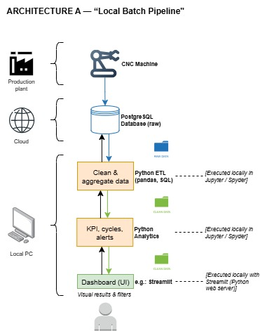
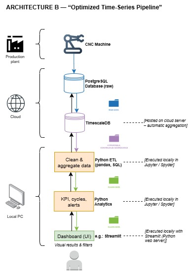
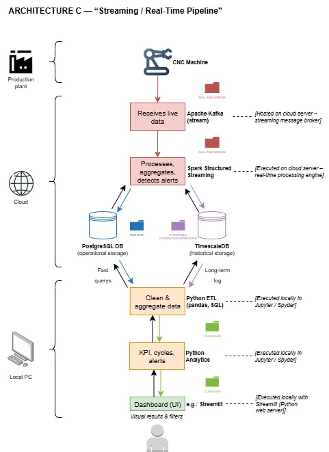

# 🧱 Architectural Evolution – CNC Data Analytics System

### ⚠️ Preliminary Note
The following architectural proposals (**Architectures A, B, and C**) have been initially designed with the support of *ChatGPT (OpenAI)* as a reference framework for the project **“Understanding from Numerical Control Driven Machining Control.”**

They represent **conceptual drafts and working hypotheses**, not final decisions.  
All elements — including component choices, data flows, and execution layers — must be **reviewed, discussed, and validated by the entire project team** before implementation.  
Any modification, simplification, or extension should be agreed upon collectively to ensure technical consistency and feasibility.

---

## ⚙️ Architecture A — “Local Batch Pipeline”

### 🔹 Concept
A simple, local-first architecture for initial experimentation.  
All processing is performed on the user’s PC, while data are stored on a remote PostgreSQL database.  
It enables the team to explore the dataset, understand machine behavior, and prototype the analytics pipeline.  

This is the **starting point** for the project — low complexity, minimal infrastructure, and ideal for the early development phase.

---

### 🧩 Main Components

| Layer | Component | Execution / Hosting | Description |
|-------|------------|--------------------|--------------|
| **Production plant** | CNC Machine | Physical system | Produces raw operational variables (axis position, spindle load, etc.) |
| **Cloud / Server** | PostgreSQL Database (raw data) | Hosted on UPM / remote server | Stores high-frequency machine signals |
| **Local PC** | Python ETL (pandas, SQL) | Executed locally in Jupyter / Spyder | Extracts and cleans data, performs simple aggregations |
| | Python Analytics | Executed locally in Jupyter / Spyder | Computes KPIs, operation time, energy per program, and alerts |
| | Streamlit Dashboard (UI) | Executed locally with Streamlit (Python web server) | Visualizes results and provides basic user interaction |
| **User** | Operator / Analyst | Local access | Explores data, applies filters, interprets results |

---

### 🔄 Workflow
1. The CNC machine sends raw variables to the PostgreSQL database.  
2. Local ETL scripts retrieve and clean the data.  
3. Analytics modules compute machine indicators and alerts.  
4. The dashboard presents results interactively.

---

### ✅ Advantages
- Very simple to deploy and maintain  
- Ideal for small datasets or offline analysis  
- Full transparency and control for debugging and learning  

### ⚠️ Limitations
- Query time increases with dataset size  
- Manual updates required (no automation)  
- No real-time feedback; purely batch operation  

---

### 🕒 Adoption timeline
Used in **Phase 1** (project start).  
Goal: validate the data model, ensure database connectivity, and develop the first analysis scripts.

---

### 📷 Architecture Diagram

---

## ⚡ Architecture B — “Optimized Time-Series Pipeline”

### 🔹 Concept
An upgraded version focusing on **performance and scalability**.  
PostgreSQL is extended with **TimescaleDB**, enabling hypertables and continuous aggregation for fast time-based queries.  
This allows the system to handle larger volumes of CNC data with near-real-time responsiveness.

---

### 🧩 Main Components

| Layer | Component | Execution / Hosting | Description |
|-------|------------|--------------------|--------------|
| **Production plant** | CNC Machine | Physical source | Streams operational data continuously |
| **Cloud / Server** | PostgreSQL (raw data) | Hosted on remote server | Stores unprocessed variables |
| | TimescaleDB | Hosted on cloud server – automatic aggregation | Extends PostgreSQL to manage time-series efficiently |
| **Local PC** | Python ETL | Executed locally in Jupyter / Spyder | Loads data, applies additional transformations and cleaning |
| | Python Analytics | Executed locally in Jupyter / Spyder | Performs KPI calculation, energy/time estimation, and alert generation |
| | Streamlit Dashboard (UI) | Executed locally with Streamlit | Visualizes aggregated data with time filters and metrics |
| **User** | Operator / Analyst | Local or LAN access | Uses the dashboard for insights and comparisons |

---

### 🔄 Workflow
1. The CNC data are inserted into PostgreSQL (raw).  
2. TimescaleDB automatically builds hypertables and continuous aggregates.  
3. Local ETL scripts access pre-aggregated data instead of raw tables.  
4. Analytics compute KPIs and alerts efficiently.  
5. The dashboard displays up-to-date results.

---

### ✅ Advantages
- Fast queries thanks to TimescaleDB hypertables  
- Continuous aggregation handled automatically on the server  
- Scalable to millions of records  
- Compatible with the same local Python workflow  

### ⚠️ Limitations
- Requires server configuration for TimescaleDB  
- Still partially manual (batch updates)  
- No true real-time streaming yet  

---

### 🕒 Adoption timeline
Used in **Phase 2** (mid-project).  
Goal: optimize performance and manage higher data volumes once the prototype is validated.

---

### 📷 Architecture Diagram

---

## 🌐 Architecture C — “Streaming / Real-Time Pipeline”

### 🔹 Concept
The most advanced version, enabling **real-time monitoring and analytics**.  
This architecture integrates **Apache Kafka** for data streaming and **Spark Structured Streaming** for on-the-fly processing.  
It combines real-time pipelines with long-term storage and visualization.

---

### 🧩 Main Components

| Layer | Component | Execution / Hosting | Description |
|-------|------------|--------------------|--------------|
| **Production plant** | CNC Machine | Physical source | Continuously generates real-time signals |
| **Cloud / Processing layer** | Apache Kafka (stream) | Hosted on cloud server – streaming message broker | Receives live data, buffers, and distributes messages |
| | Spark Structured Streaming | Executed on cloud server – real-time processing engine | Processes Kafka streams, detects patterns and alerts, forwards results |
| | PostgreSQL (operational storage) | Hosted on remote server | Stores latest operational data for fast queries |
| | TimescaleDB (historical storage) | Hosted on remote server | Maintains long-term time-series logs and aggregates |
| **Local PC** | Python ETL | Executed locally in Jupyter / Spyder | Periodically integrates cloud data for additional analysis |
| | Python Analytics | Executed locally in Jupyter / Spyder | Further exploration and validation of real-time results |
| | Streamlit Dashboard (UI) | Executed locally with Streamlit | Displays live machine state, alerts, and KPIs in near real-time |
| **User** | Operator / Analyst | Web access | Monitors operations and system health interactively |

---

### 🔄 Workflow
1. CNC sensors send live data streams to Apache Kafka.  
2. Kafka buffers and forwards events to Spark Structured Streaming.  
3. Spark aggregates and processes data in micro-batches, detecting operation cycles and anomalies.  
4. Results are written to PostgreSQL (for fast querying) and TimescaleDB (for historical logs).  
5. The Streamlit dashboard continuously updates with live KPIs and alerts.

---

### ✅ Advantages
- Real-time data ingestion and processing  
- Immediate alerting and visualization  
- Hybrid storage (short-term + long-term)  
- Scalable to industrial workloads  

### ⚠️ Limitations
- Higher infrastructure complexity  
- Requires Kafka and Spark deployment  
- Needs reliable network and cloud configuration  

---

### 🕒 Adoption timeline
Used in **Phase 3** (final stage).  
Goal: demonstrate real-time analytics capability, provide continuous monitoring, and connect the full data lifecycle (machine → cloud → user).

---

### 📷 Architecture Diagram

---

## 🧭 Overall Evolution Summary

| Stage | Main Goal | Key Technologies | Deployment Level |
|--------|------------|------------------|------------------|
| **A – Local Batch** | Prototype, data understanding | PostgreSQL, Python (pandas), Streamlit | Local execution |
| **B – Time-Series Optimized** | Performance & scalability | TimescaleDB, Python (ETL/Analytics) | Local + Cloud |
| **C – Streaming / Real-Time** | Real-time insights & automation | Kafka, Spark, PostgreSQL, TimescaleDB | Cloud + Local UI |

---

## 🔄 Progressive Implementation Strategy

1. **Phase 1:** Start with *Architecture A* → focus on ETL pipeline, KPIs, and dashboard.  
2. **Phase 2:** Migrate to *Architecture B* → activate TimescaleDB and optimize queries.  
3. **Phase 3:** Extend to *Architecture C* → integrate streaming for real-time feedback and alerts.

---

This progressive approach ensures that:
- The team learns the full data lifecycle step by step.  
- Each phase delivers a working, demonstrable system.  
- The final architecture (C) aligns with modern **Industry 4.0** and **IoT** paradigms — turning raw CNC signals into real-time, actionable intelligence.

